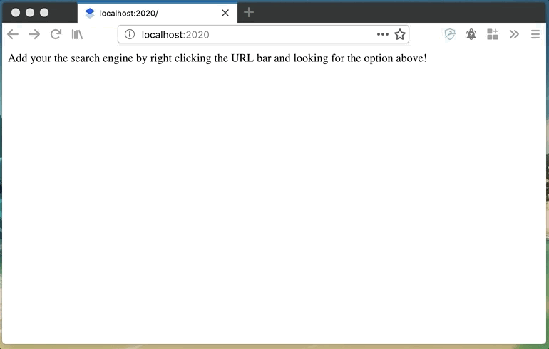

# OpenSearch Proxy

This is an opensearch wrapper that you can use to provide search for whatever
you want. I developed this because Dropbox Paper's opensearch implementation is
nonexistant: There are no suggestions and search requires you to load the page.

The example I provide is a wrapper for Dropbox Paper, but you could
theoretically implement this for whatever you want.

## Using the search engine

Start the proxy (which starts an HTTP server) in order to power search results.
Then:

### Firefox

### Chrome

Load the page, leave it open for some amount of time - after a bit, you should
be able to hit tab and search using that page's URL.
